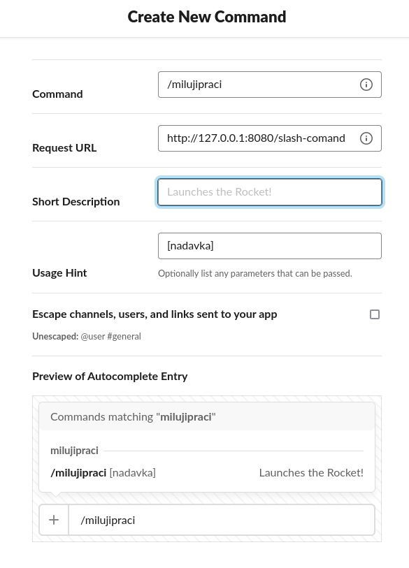
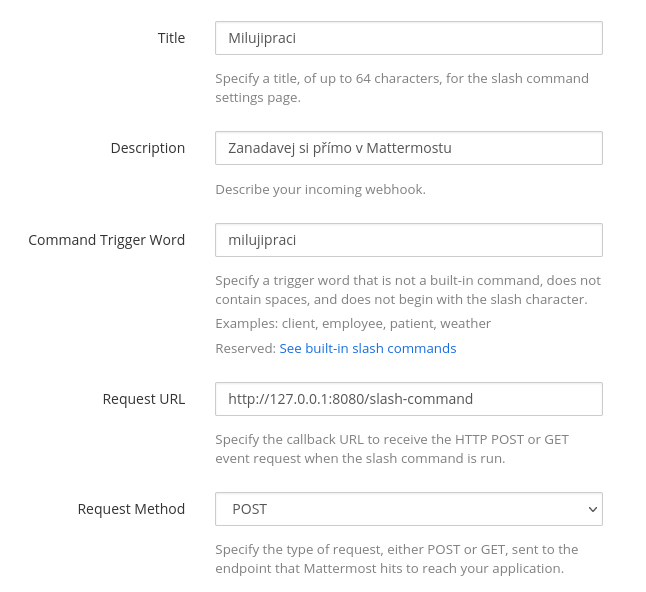

# Slash command pro milujipraci.cz

> This project is by its nature dedicated to czech or
> slovak speaking users, so I suggest you to either learn Czech or move on.
>
> But you are missing out!

S ohledem na blahodárné terapeutické účinky webové aplikace [milujipraci.cz](http://milujipraci.cz/) (velký dík jejímu
autorovi!), je třeba ji ještě více zpřístupnit zdeptaným a vysíleným zaměstnancům, aby nemuseli při nadávámí opouštět
ani jejich korporátní komunikátor.

Pokud tedy ve firmě používáte Slack nebo Mattermost, stačí si pustit tuhle jednoduchou binárku a nastavit si integraci
slash commandu a budete moct nadávat přímo ve v průběhu konverzace.

###Ukázka


## Spuštění

#### Build

```bash
go run github.com/fusakla/slash-milujipraci
```

#### Docker

```bash
docker run -it -p 8080:8080 fusakla/slash-milujipraci:latest
```

#### Kubernetes

Manifesty naleznete v [`./kubernetes`](./kubernetes)

### Konfigurace

Defaultně aplikace očekává, že bude spuštěna pomocí trigger word `/milujipraci`. To lze změnit pomocí
flagu `--trigger-word`.

```bash
$ ./slash-milujipraci --help
usage: slash-milujipraci [<flags>]

Flags:
  --help                        Show context-sensitive help (also try --help-long and --help-man).
  --debug                       Enable debug mode.
  --listen-address="0.0.0.0:8080"  
                                Address to listen on for API
  --trigger-word="milujipraci"  Trigger word used
  --version                     Show application version.
```

## Nastavení integrace

Nahraďte `http://127.0.0.1:8080` za URL, na které je vaše instance dostupná.

### Slack

Jdi na https://api.slack.com/apps

> `Create new app > From scratch > Slash commands > Create new command`



### Mattermost

> `Integrations > Slash commands > Add slash command`



